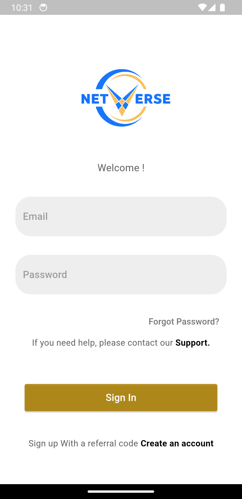
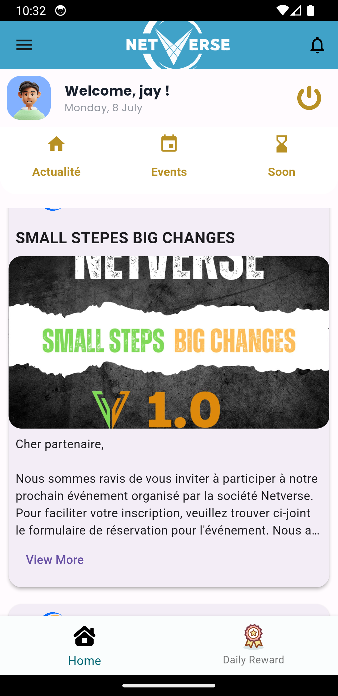
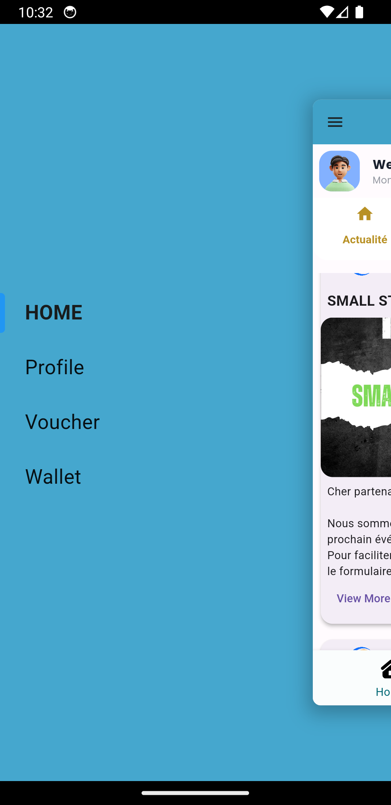
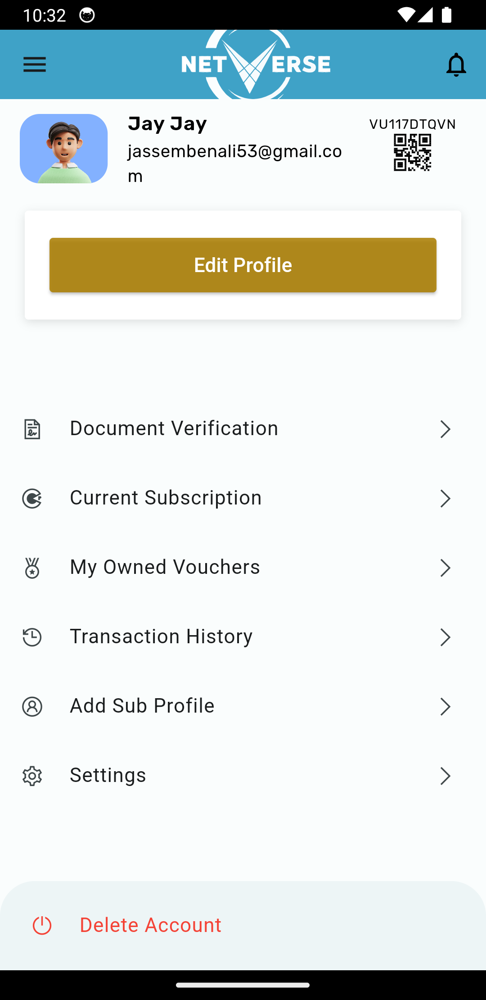
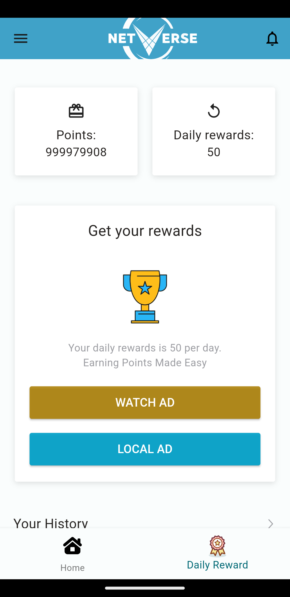

# SocialMediaApp

**Social Media Application**

SocialMediaApp is a unique platform that allows users to post events and blogs, earn points by watching ads, sign in using a referral link, and convert points to AC coins. Users can also send points to other users and redeem vouchers. Note that this application does not include chat functionality.

## Features

- **Post Events and Blogs**: Share your events and blog posts with the community.
- **Earn Points by Watching Ads**: Gain points by engaging with advertisements.
- **Referral Sign-in**: Sign in using a referral link from an existing user.
- **Vouchers**: Redeem vouchers within the app.
- **Send Points to Other Users**: Transfer points to your friends.
- **Wallet and AC Coin**: Convert your points to AC coin in your wallet.
- **No Chat**: This application does not have a chat feature.

## Screenshots

- **Login Screen**

  


- **Home Screen**

  

- **Menu**

  

- **Profile Screen**

  

- **Watch Ads Screen**

  


## Installation

To use this application, follow these steps:

1. **Clone the repository:**

   ```bash
   git clone https://github.com/yourusername/socialmedia_app.git
   ```
2. **Navigate to the project directory:**

   ```bash
   cd socialmedia_app
   ```
3. **Install the dependencies:**

   ```bash
   flutter pub get
   ```
4. **Run the application:**

   ```bash
   flutter run
   ```

## Usage
1. Open the application.

2. Allow location permissions if required.

3. Create an account or sign in using a referral link.

4. Post events and blogs to share with the community.
5. Watch ads to earn points.
6. Redeem vouchers within the app.
7. Send points to other users.
8. Navigate to the wallet to convert points to AC coin.